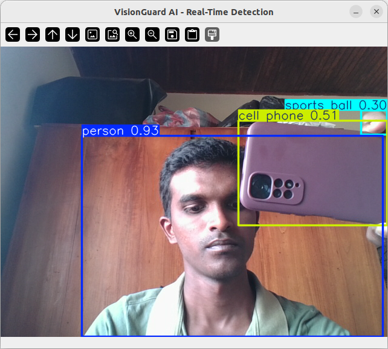

# 👁️ VisionGuard AI: Real-Time Object Detection

**VisionGuard AI** is a real-time computer vision application that detects and classifies objects using the **YOLOv8** (You Only Look Once) architecture. It processes live webcam feeds to identify people, everyday objects (cell phones, bottles), and potential hazards with high speed and accuracy.

## 🚀 Features
* **Real-Time Inference:** Processes video frames at 30+ FPS using YOLOv8 Nano/Medium models.
* **Live Annotation:** Draws bounding boxes and confidence scores around detected objects instantly.
* **Hardware Optimized:** Efficiently runs on local CPU (and GPU if available).
* **Privacy Focused:** All processing happens locally; no video data is sent to the cloud.

## 🛠️ Tech Stack
* **Language:** Python 3.10+
* **Core Model:** [YOLOv8](https://github.com/ultralytics/ultralytics) (State-of-the-art Object Detection)
* **Computer Vision:** OpenCV (`cv2`) for video capture and image processing.

## 📸 Demo

*(Note: Upload your screenshot and name it 'screenshot.png' for this to show up!)*

## 📦 Installation

1.  **Clone the repository:**
    ```bash
    git clone [https://github.com/MalindaBotheju/VisionGuard-AI.git](https://github.com/MalindaBotheju/VisionGuard-AI.git)
    cd VisionGuard-AI
    ```

2.  **Create a Virtual Environment:**
    ```bash
    python3 -m venv venv
    source venv/bin/activate  # On Windows: venv\Scripts\activate
    ```

3.  **Install Dependencies:**
    ```bash
    pip install ultralytics opencv-python
    ```

## 🚦 Usage

1.  **Run the Application:**
    ```bash
    python3 app.py
    ```
2.  **Controls:**
    * Press **`q`** to quit the application.

## 🔧 Troubleshooting (Linux/Ubuntu)

If you see a **Black Screen** or `(no detections)`:

1.  **Check Permissions:** Ensure your user has access to the video device.
    ```bash
    sudo usermod -aG video $USER
    # You must Log Out and Log In after running this.
    ```
2.  **Check Camera Index:**
    If your laptop has multiple video devices, you may need to change the camera index in `app.py`:
    ```python
    cap = cv2.VideoCapture(0)  # Try 0, 1, or 2
    ```
3.  **Privacy Shutter:**
    Ensure your laptop's physical webcam slider is open!

---
*Built by Malinda Botheju*
